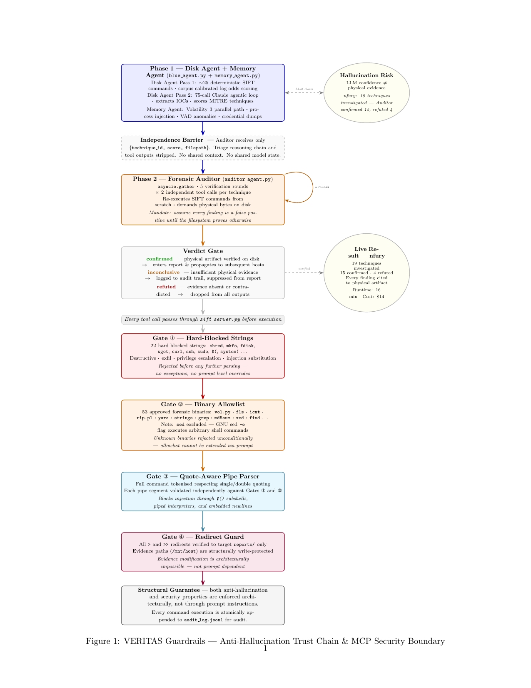

# ADVERSA — Autonomous Windows Forensic Investigation

A three-phase pipeline for dead-disk and memory forensics on Windows images.
Deterministic triage → agentic investigation → adversarial audit.
**Every confirmed finding is backed by a physical artifact on disk — not model confidence.**

Built for the **SANS FIND EVIL! Hackathon 2026** · Category 7: Persistent Learning Loop

---

## The Problem Nobody Solved

Every tool closes the speed gap. ADVERSA closes the trust gap.

Autonomous AI investigators hallucinate. Ask an LLM whether credential dumping occurred and it
will find something that looks like credential dumping — whether or not the binary is actually on
disk. Prompt instructions do not fix this. The leading platform in this space (Valhuntir) reached
the same conclusion and kept the human in the loop.

**ADVERSA is the architecture that removes the human from the verification loop without losing
forensic integrity.** A finding is only CONFIRMED when a second independent agent — one that
receives the findings list and nothing else — calls a real forensic tool and reads physical bytes
off disk. Model confidence produces neither CONFIRMED nor REFUTED.

---

## Architecture


**Phase 1 — Deterministic triage** (~25 SIFT commands, no LLM, <60 s)
Corpus-calibrated log-odds weights from 800+ labeled malware samples. Fully reproducible.

**Phase 2 — Triage Agent (The Optimist)** (75-call Claude budget)
Investigates event logs, prefetch, SAM hives, registry, network artifacts.
Receives raw artifacts only — no Phase 1 score, no technique labels. Structural decoupling.

**Memory — Volatility 3** (parallel)
Process injection, VAD anomalies, credential dumps invisible on disk.

**Phase 3 — Forensic Auditor (The Cynic)** (parallel, isolated MCP sessions)
Receives the findings list and nothing else. Mandate: assume every finding is false until
the filesystem proves otherwise. CONFIRMED requires a positive tool return value.
Runs all challenges concurrently via `asyncio.gather`.

**IOC extraction → HTML report → campaign propagation**

---

## Results

Three hosts, real SANS case data. All findings independently reproducible from audit log.

### nfury (10.3.58.6) — full pipeline

| Phase | Score | Detail |
|---|---|---|
| Triage Pass 1 (deterministic) | 20/100 | T1560.001 — archive file extensions |
| Triage Pass 2 (agentic, 75 calls) | 100/100 | 13 additional techniques surfaced |
| Memory (Volatility 3, parallel) | 100/100 | 6 memory-resident techniques |
| Auditor adjusted | 100/100 | **15 confirmed, 4 refuted** |
| Runtime | 969 s (~16 min) | Cost: ~$14 |

Confirmed attack chain: httppump backdoor (`svchost.exe` in `$Recycle.Bin`, timestomped 2008,
SHA-256 `f293fdb9…`), C2 at `192.168.1.5/ads/`, loader `a.exe` (PDB: `httppump/inner/i.pdb`,
127 `PAGE_EXECUTE_READWRITE` VADs via malfind), `SRL-Helpdesk` account creation (Event ID 4720),
`psexesvc.exe` on disk (T1569.002), `system4.rar` + `chrome.7z` exfil staging.

Refuted (4): T1071.001, T1134, T1547.001, T1574 — memory-only signals, no disk corroboration.
**The refutals are the proof the architecture works.**

### tdungan (10.3.58.7) — campaign mode with nfury IOCs

| Phase | Score | Detail |
|---|---|---|
| Triage (disk + memory) | 100/100 | 17 techniques detected |
| Auditor adjusted | 100/100 | **13 confirmed, 4 refuted** |
| Runtime | 880 s (~15 min) | Cost: ~$14 |

T1566 (Phishing) confirmed — campaign initial access identified. `HYDRAKATZ.EXE` in Prefetch
(Hydra + Mimikatz, purpose-built credential harvester). `SRL-Helpdesk` NTLM hash `4c3f5e9f…`
**matches nfury exactly** — credential reuse confirmed across hosts. Different httppump variant
(SHA-256 `91f16fc5…`): same C2, evolved tooling.

### nromanoff (10.3.58.5) — standalone, distinct tool family

| Phase | Score | Detail |
|---|---|---|
| Triage (disk + memory) | 100/100 | 7 techniques detected |
| Auditor adjusted | 100/100 | **3 confirmed, 4 refuted** |
| Runtime | ~880 s (~15 min) | Cost: ~$14 |

`spinlock.exe` — PyInstaller Python backdoor, distinct from httppump. External C2 at
`199.73.28.114:443` with self-signed TLS cert (`CN=199.73.28.114`) — the only confirmed
live external C2 in the campaign. `PSEXESVC.EXE` on disk (T1569.002). `vibranium` account
credentials extracted from memory. Same refutation pattern: 4 memory-only signals with no
disk corroboration — consistent with nfury and tdungan.

### rocba (192.168.1.5) — the attacker's C2 relay node

Disk score: 0. Memory score: 100. T1055 confirmed in `MsMpEng.exe` (Windows Defender's engine).
Two anonymous VadS `PAGE_EXECUTE_READWRITE` regions containing a shellcode dispatch trampoline
(`push rsi/rdi/rbx; sub rsp, 0x28; jmp rdx`). The attacker injected into their own AV.
rocba's IP is `192.168.1.5` — the C2 address hardcoded in every httppump variant recovered from
nfury and tdungan. Verdict: LOW (single confirmed technique — scoring limitation, not an evidence
limitation).

**31 techniques confirmed across 43 detected. 12 correctly refuted. 3 investigative hosts. Under $45 total.**

---

## Security Boundary



Every forensic action flows through one MCP primitive: `run_terminal_command`.
Four gates execute in Python before any subprocess call.

1. **Hard-blocked strings** — 22 tokens: `shred`, `mkfs`, `curl`, `wget`, `nc`, `sudo`,
   `$()`, backtick, `system(`, specific service control verbs. Command substitution blocked
   because an attacker-controlled log can inject a second command as an argument.
2. **53-binary SIFT allowlist** — unknown binaries rejected unconditionally. `sed` excluded —
   its `-e` flag passes the pattern space to the shell.
3. **Quote-aware pipeline parser** — tracks single-quoted substrings; `|` inside quotes is
   argument content, not a separator. Required for `grep -iE '(http|https|ftp)'`.
4. **Write-target guard** — all `>`, `>>`, `tee` targets resolved via `os.path.realpath()`.
   Must land inside `reports/`. Symlink and `../` injection fail at the math level.

`audit_log.jsonl` is appended atomically via `os.open + os.write` before every subprocess call.
Evidence modification is structurally impossible — not prompt-dependent.

---

## Quick Start

```bash
git clone https://github.com/sassom2112/find-evil-2026.git
cd find-evil-2026
pip install -r requirements.txt
export ANTHROPIC_API_KEY="sk-ant-..."

# Terminal 1 — MCP forensic tool server
python3 custom-agent/sift_server.py

# Terminal 2 — full investigation
python3 custom-agent/investigate.py --case /mnt/hostname

# Fast deterministic triage only — no API key, <10 s
python3 fast-triage/fast_triage.py /mnt/hostname
```

Requires a mounted Windows disk image (read-only). The framework reads via standard SIFT/Sleuth
Kit tools — no write access to evidence.

### Campaign mode — explicit IOC propagation

```bash
# Investigate first host
python3 custom-agent/investigate.py --case ~/cases/nfury

# Second host with nfury IOCs injected (explicit declaration required)
python3 custom-agent/investigate.py --case ~/cases/tdungan nfury

# Third host with all prior IOCs
python3 custom-agent/investigate.py --case ~/cases/controller nfury tdungan
```

Host names resolve to `reports/<host>-iocs.json`. Explicit declaration prevents cross-campaign
contamination — IOCs are never injected automatically.

### Rebuild signal weights

```bash
# Collect malware corpus from MalwareBazaar + HybridAnalysis
MB_API_KEY=your_key HA_API_KEY=your_key python3 custom-agent/build_corpus.py --limit 100
python3 custom-agent/compute_weights.py        # → data/calibrated_weights.json

# Retrain Sysmon ASL (requires Mordor datasets — see DATASET.md)
python3 custom-agent/brain.py                  # ~30 min, 4500 iterations
python3 custom-agent/export_patterns.py        # → reports/operational_rules.json
```

---

## Detection Signal Stack

Two independent signal sources feed Pass 1 scoring.

**Corpus-calibrated weights** (`data/calibrated_weights.json`)
Log-odds ratios from 800+ labeled samples (MalwareBazaar + HybridAnalysis):
```
log_odds = log2( (p_malware + 0.05) / (p_benign + 0.05) )
weight   = normalize(log_odds) → [0, 1]
```
Covers 9 MITRE techniques. Every weight traceable to a source SHA-256.

**Sysmon ASL operational rules** (`reports/operational_rules.json`)
Trained adversarially on 49,519 real Windows Sysmon events (OTRF Mordor).
Red Agent generates evasion variants; Blue Agent extracts discriminating field values from misses.
2,031 logged evasion attempts. Each exported Sigma rule embeds its bypass rate.

Domain gap acknowledged: Sysmon signals reference event fields absent from static disk output.
These rules supplement corpus weights — they are not disk-validated independently.

---

## Components

| File | Role |
|---|---|
| `custom-agent/investigate.py` | Orchestrator — full pipeline end to end |
| `custom-agent/blue_agent.py` | Triage Agent — Pass 1 scoring + Pass 2 agentic loop |
| `custom-agent/auditor_agent.py` | Forensic Auditor — adversarial parallel re-verification |
| `custom-agent/memory_agent.py` | Memory analysis — Volatility 3 parallel path |
| `custom-agent/sift_server.py` | MCP server — 4-gate validator, subprocess execution |
| `custom-agent/extract_iocs.py` | IOC extraction — confirmed artifacts only |
| `custom-agent/html_report.py` | HTML report — exec summary, IOC table, Auditor transcript |
| `custom-agent/build_corpus.py` | Corpus collection — MalwareBazaar + HybridAnalysis |
| `custom-agent/compute_weights.py` | Weight calibration — log-odds from corpus |
| `custom-agent/brain.py` | Sysmon ASL training — Red/Blue adversarial loop |
| `custom-agent/export_patterns.py` | Exports trained signals → `operational_rules.json` |
| `fast-triage/fast_triage.py` | Deterministic triage — no LLM, sub-10 s |

---

## Honest Limitations

**87% false positive rate on benign endpoints.** The triage layer is calibrated for
high-base-rate forensic investigation of known-suspicious images, not live endpoint monitoring.
The Auditor mitigates this in deployment — on nfury, 19 triage detections reduced to
15 confirmed findings with artifact citations.

**Three hosts, one campaign.** nfury, tdungan, and rocba share an operator and C2 infrastructure.
Generalization to a novel campaign with different tooling is not yet validated.

**Sysmon ASL domain gap.** Signals learned from live event telemetry do not transfer cleanly to
static disk forensic output. Documented, not papered over.

**Volatility malfind timeouts.** On large memory images, `windows.malfind` can exceed the
120 s subprocess timeout. The Auditor falls back to direct vol invocation and marks the finding
INCONCLUSIVE if evidence cannot be recovered — it fails safe.

**$14/host, ~16 minutes.** Cheap relative to analyst time. Not free. Does not scale to 500
simultaneous endpoints without parallel infrastructure.

---

## License

MIT
